# 🌊 DeFlow - AI-Powered DeFi Workflow Automation

> Visual workflow builder combining **Lit Protocol**, **ASI Alliance**, and **Blockscout** for secure, intelligent DeFi operations

---

## 🎯 The Problem


**Current DeFi is fragmented:** Users manually switch between protocols, manage private keys, and lack intelligent automation.

---

## ✨ Our Solution

**DeFlow** = Visual Workflow Builder + Autonomous Execution + AI Agents


### Key Innovations

🔐 **Lit Protocol (Vincent SDK)** - Decentralized key management with PKPs (Programmable Key Pairs)  
🤖 **ASI Alliance** - AI agents for strategy generation and blockchain data queries  
🔍 **Blockscout MCP** - Real-time blockchain data via Model Context Protocol  
🎨 **Visual Builder** - No-code interface for complex DeFi strategies

---

## 🏗️ Architecture


---

## 🔧 How It Works

### 1️⃣ User Creates Workflow


### 2️⃣ Execution Flow

```mermaid
sequenceDiagram
    participant User
    participant Engine as Workflow Engine
    participant Lit as Lit Protocol
    participant ASI as ASI Agent
    participant Blockscout
    participant Chain as Blockchain
    
    User->>Engine: Execute Workflow
    
    Engine->>Blockscout: Query balance (via MCP)
    Blockscout-->>Engine: Token balance data
    
    Engine->>ASI: Analyze strategy
    ASI-->>Engine: AI recommendation
    
    Engine->>Lit: Sign swap transaction
    Lit->>Lit: PKP threshold signing
    Lit->>Chain: Submit signed transaction
    Chain-->>Engine: Transaction hash
    
    Engine-->>User: Execution complete ✓
```



### 3️⃣ Node Types

| Node | Purpose | Integration |
|------|---------|-------------|
| 🎯 **Trigger** | Start workflow (manual/scheduled) | - |
| 💱 **Swap** | Token swaps via Uniswap V3 | Lit Protocol |
| 🏦 **Aave** | Supply/withdraw/borrow | Lit Protocol |
| 📤 **Transfer** | Send ERC20 tokens | Lit Protocol |
| 🔀 **Condition** | Conditional branching | Engine logic |
| 🤖 **AI** | AI analysis + agent queries | ASI + Agentverse |

---

## 🔐 Lit Protocol Integration

**Vincent SDK** provides secure, decentralized transaction signing via **PKPs (Programmable Key Pairs)**.


### Key Benefits

- ✅ **No Private Keys** - Users never handle private keys directly
- ✅ **Decentralized** - Threshold signing across Lit nodes (no single point of failure)
- ✅ **Policy Control** - Define what operations PKPs can perform
- ✅ **Multi-Chain** - Same PKP works across 8+ EVM chains

### Abilities Used

- `uniswapSwapAbility` - Execute Uniswap V3 swaps with slippage protection
- `erc20ApproveAbility` - Approve token spending for protocols
- `aaveSupplyAbility` / `aaveWithdrawAbility` - Interact with Aave V3
- `erc20TransferAbility` - Transfer tokens between addresses

---

## 🤖 ASI Alliance Integration

**ASI:One** provides AI-powered analysis and agent coordination via the **Agentverse**.


### Registered Agents

| Agent | Address | Purpose |
|-------|---------|---------|
| **Blockscout MCP Agent** | `agent1qfwanzm7l94lcd57p9zsl25y4p6clssp8xjjrd0f8f6nc9r3rx8h6978x2r` | Query blockchain data (balances, txns, NFTs) |
| **DeFi Workflow Builder** | `agent1qv5658stegsd5azsaluh5eel6mp8meafkw3egsren6sc3m2nnujtgwtgdwx` | Generate workflows from natural language |

### AI Node Features

- **Direct AI Reasoning** - ASI:One provides intelligent analysis
- **Agent Connection** - Select preset agents (Blockscout MCP) or custom addresses
- **Context Awareness** - AI receives previous node outputs for informed decisions
- **Natural Language** - Users write prompts like "Check my USDC balance on Base"

---

## 🔍 Blockscout MCP Integration

**Blockscout MCP** (Model Context Protocol) provides real-time blockchain data via a standardized interface.


### Supported Chains

Base • Ethereum • Polygon • Arbitrum • Optimism • BNB • Avalanche • Celo

### MCP Tools Available

- `get_address_balance` - Get native + token balances
- `get_transactions` - Fetch transaction history
- `get_nft_holdings` - Query NFT collections
- `search_contracts` - Find verified contracts

### Integration Flow

1. **Blockscout MCP Agent** wraps the MCP server as a discoverable Agentverse agent
2. **AI Node** connects to agent via agent address
3. **Agent queries** blockchain data using MCP JSON-RPC protocol
4. **Results** returned to AI for analysis and workflow decisions

---

## 📦 Project Structure

```
ethonline-defi-layer/
├── frontend/                    # React + TypeScript + Vite
│   ├── src/
│   │   ├── pages/
│   │   │   ├── LandingPage.tsx
│   │   │   ├── WorkflowBuilderPage.tsx  # Main builder (React Flow)
│   │   │   └── AuthCallback.tsx
│   │   ├── contexts/
│   │   │   └── AuthContext.tsx           # Vincent OAuth state
│   │   └── lib/
│   │       ├── vincentAuth.ts            # Vincent SDK auth
│   │       └── apiClient.ts              # Backend API
│   └── package.json
│
├── backend/                     # Node.js + Express + MongoDB
│   ├── src/
│   │   ├── controllers/
│   │   │   └── workflowController.js     # Workflow execution engine
│   │   ├── config/
│   │   │   └── vincent.js                # Lit Protocol config
│   │   └── routes/
│   │       ├── workflowRoutes.js
│   │       └── authRoutes.js
│   └── package.json
│
└── backend-python/              # Python agents + MCP
    ├── agents/
    │   ├── blockscout_mcp_agent.py       # Blockscout MCP wrapper
    │   └── workflow_builder_mailbox.py   # AI workflow generator
    ├── utils/
    │   └── mcp_client.py                 # MCP client (lazy loading)
    ├── server.py                         # Flask REST API
    └── requirements.txt
```

---

## 🚀 Getting Started

### Prerequisites

- Node.js 18+
- Python 3.11+
- MongoDB
- Vincent SDK credentials ([Get API keys](https://docs.heyvincent.ai/))

### 1. Clone Repository

```bash
git clone https://github.com/AceVikings/ethonline-defi-layer.git
cd ethonline-defi-layer
```

### 2. Backend Setup (Node.js)

```bash
cd backend
npm install

# Configure environment
cp .env.example .env
# Add your MongoDB URI and Vincent credentials

npm start  # Runs on http://localhost:3001
```

### 3. Python Services Setup

```bash
cd backend-python
pip install -r requirements.txt

# Start agents
bash start_blockscout_agent.sh      # Port 8001
python agents/workflow_builder_mailbox.py  # Port 8000

# Start Flask API
python server.py  # Port 8080
```

### 4. Frontend Setup

```bash
cd frontend
npm install
npm run dev  # Runs on http://localhost:5173
```

### 5. Vincent OAuth

1. Visit `http://localhost:5173`
2. Click "Sign in with Vincent"
3. Authorize application
4. PKP wallet created automatically

---

## 💡 Example Workflows

### 1. DCA (Dollar Cost Average)

```
[Trigger: Daily] 
  → [Swap: 100 USDC → ETH via Uniswap]
  → [Condition: ETH balance > 1]
    → True: [Aave: Supply ETH]
    → False: [Continue DCA]
```

### 2. AI-Powered Rebalance

```
[Trigger: Manual]
  → [AI: "Check my portfolio balance on Base"]
  → [Condition: USDC > 60%]
    → True: [Swap: 50% USDC → ETH]
  → [Transfer: Send to cold wallet]
```

### 3. Yield Optimization

```
[Trigger: Weekly]
  → [AI: Connect to Blockscout agent - "Find highest APY on Aave"]
  → [Aave: Withdraw from old position]
  → [Swap: Convert to optimal token]
  → [Aave: Supply to highest APY pool]
```

---

## 🧪 Testing

### Test Blockscout MCP Agent

```bash
cd backend-python
python -c "
from agents.blockscout_mcp_agent import call_blockscout_mcp
result = call_blockscout_mcp('get_address_balance', {
    'address': '0x742d35Cc6634C0532925a3b844Bc9e7595f0bEb3',
    'chainId': '8453'
})
print(result)
"
```

### Test Workflow Execution

```bash
curl -X POST http://localhost:3001/api/workflows/execute/YOUR_WORKFLOW_ID \
  -H "Authorization: Bearer YOUR_JWT" \
  -H "Content-Type: application/json"
```

---

## 🛠️ Technology Stack

| Category | Technologies |
|----------|-------------|
| **Frontend** | React 18, TypeScript, Vite, React Flow, Tailwind CSS |
| **Backend** | Node.js, Express.js, MongoDB, Mongoose |
| **Blockchain** | Lit Protocol (Vincent SDK), Ethers.js |
| **AI** | ASI:One API, Fetch.ai uAgents, Agentverse |
| **Data** | Blockscout MCP, Model Context Protocol |
| **DeFi** | Uniswap V3, Aave V3, ERC20 tokens |

---

## 🔗 Links

- **Live Demo**: [deflow.app](https://deflow.app) _(Coming Soon)_
- **Lit Protocol**: [docs.heyvincent.ai](https://docs.heyvincent.ai/)
- **ASI Alliance**: [fetch.ai](https://fetch.ai/)
- **Blockscout MCP**: [mcp.blockscout.com](https://mcp.blockscout.com/)
- **Agentverse**: [agentverse.ai](https://agentverse.ai/)

---

## 📄 License

MIT License - see [LICENSE](LICENSE)

---

## 🤝 Contributing

Contributions welcome! Please open an issue or submit a PR.

---

**Built with ❤️ for ETHOnline 2024**
